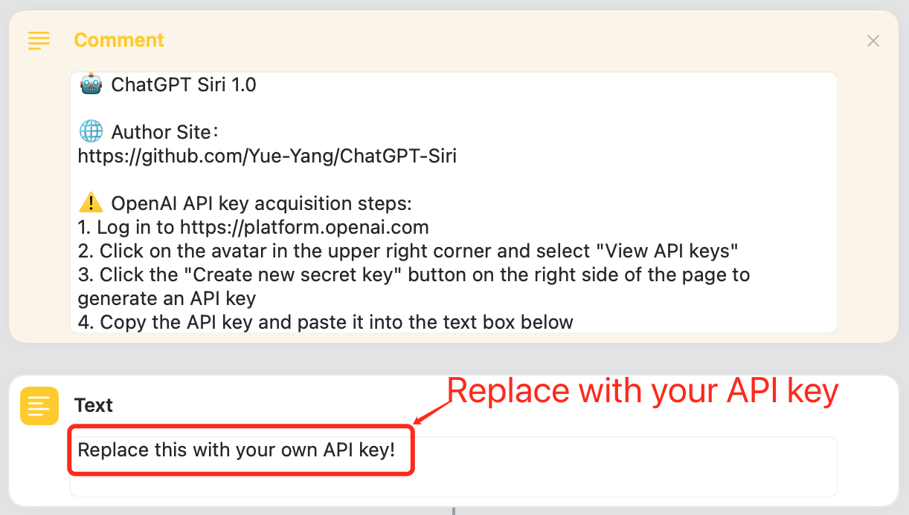
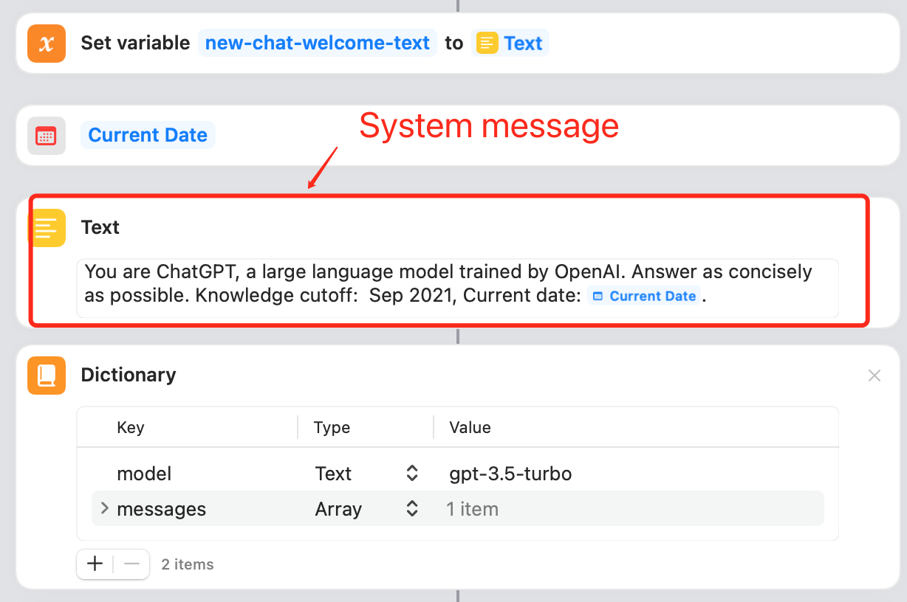

# 🤖️ ChatGPT Siri

🀄️ [简体中文 ReadMe](README-zh_CN.md)

Start the "Shortcut" through Siri to connect to the ChatGPT API, turning Siri into an AI chat assistant. You can speak your question directly to Siri, and Siri will answer you. Now our Siri has finally become intelligent and can talk to us fluently! And all this can be done with just a Shortcut and an API key.

# Shortcut Download

Click the link below to download shortcuts

## ChatGPT Siri 1.0

- [简体中文版](https://www.icloud.com/shortcuts/620e11d10bc4419497c0fd323e3fe8f1)
- [English Version](https://www.icloud.com/shortcuts/4535286f97384f839439a865faacb9d2)

## ChatGPT Siri 1.1

New feature: support for automatically saving chat records to the "Notes" app

- [简体中文版](https://www.icloud.com/shortcuts/b7c3c9939c2c43598caa1efcb3dad954)
- [English Version](https://www.icloud.com/shortcuts/e288497f0de742fdb076195afd3bef86)

# API key acquisition

To use the "shortcut" to call the ChatGPT API, an OpenAI API key is required. You can go to the OpenAI official website to get it for free, the steps are as follows:

1. Go to https://platform.openai.com to register an account and log in
2. Click on the avatar in the upper right corner and select "View API keys"
3. Click the "Create new secret key" button on the right side of the page to generate an API key
4. Copy the API key for backup. Note that the API key only appears once. If you forgot it, regenerate a new

> Note: There is a fee to use the API, the price is $0.0020 / 1K tokens, 1k tokens is approximately equal to 750 words, or 500 Chinese characters. New users of OpenAI will have a credit of $18 to be used during your first 3 months. Therefore, it is best not to share the API key with others. If the API key is leaked, you can delete it in the OpenAI background and generate a new one.

# Edit shortcut to replace API key

Open the "Shortcuts" app, find the downloaded "ChatGPT" shortcut, press and hold to select "Edit", and paste the above API key into the text box below.

# How to use

Start the "shortcut" with Siri, just say "Hey, Siri, ChatGPT", and then you can start chatting with Siri, our Siri has become very smart, enjoy! 🎉

If you don't like the name, you can rename the shortcut, change it to any name you like, and then you can chat with Siri just say "Hey, Siri, xxx", xxx is the new name you  chose, it's better not to add special symbols to the name. It’s hard to read the symbols 😂, If Siri cannot match the name of the shortcut, it won’t work!

Of course, you can also directly click the shortcut to use. At this time, it is used in the form of a dialog box, and it will not be read out. You can add it to your Home Screen for quick access. end 🎉

# Advanced usage

This shortcut supports iPhone, iPad and Mac, supports continuous conversations, supports quit chat, new chat. The usage is as follows:

- The default is to support continuous dialogue, which can record context and discuss issues continuously.
- If you want to start a new chat, say "New chat" when it's our turn, Siri will start a new round of chat, which means that the previous context will be lost, and you can't continue chatting with the previous information.
- If you want to quit ChatGPT to use the system's Siri, you can say "Quit chat" on your turn. Of course, you can also close Siri directly and open it again. But here it is more natural to provide the command to exit.

## Customize system message

You can also customize system message, which help set the behavior of the assistant. In this "shortcut" system message is one of the default system messages of ChatGPT used:

> You are ChatGPT, a large language model trained by OpenAI. Answer as concisely as possible. Knowledge cutoff: {knowledge_cutoff} Current date: {current_date}

Modify method, edit the "shortcut", slide down, and find the position as shown in the figure:

For example, you can replace system message with the following:

> I will let you act as a translator. Your goal is to translate any language into English. Please do not use an interpreter accent when translating, but to translate naturally, smoothly and authentically, using beautiful and elegant expressions.

Of course, you can also write it yourself, such as asking him to be a joker, a writer, a chef, etc. There are endless ways to play. You can also find a prompt written by someone else on the Internet, and fill it in here with a little modification. Here it is recommended to  duplicate the "shortcut" and give the cope one a different name. For example, the shortcut for translation is called "My Translator", so you can just say "Hey, Siri, My Translator", and start a ChatGPT dedicated to translation.

Also you can directly say what you want the ChatGPT to be when it's your turn to say. For example    ask him to help you as a translator. But it’s not as convenient as the “shortcut” above that specifically modifies the system message for translation. That “translator” can work directly, which is very nice! This is also the meaning of Prompt, you can customize the using scene first, and then use ChatGPT more efficiently. This is why there are so many awesome prompt tutorials on the Internet. We can build our own prompt suitable for us and let ChatGPT to be more powerful!